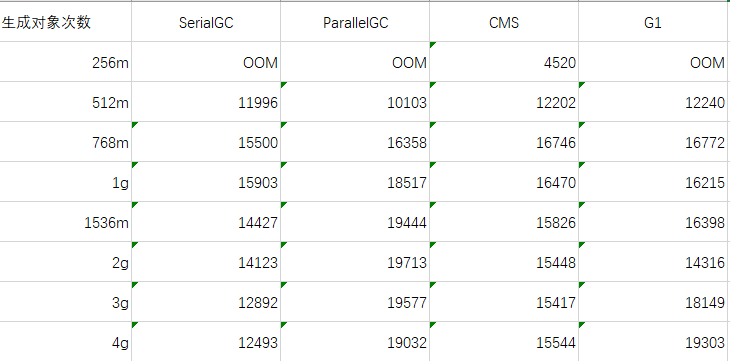
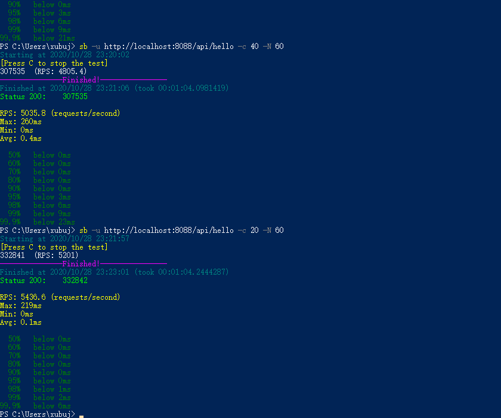
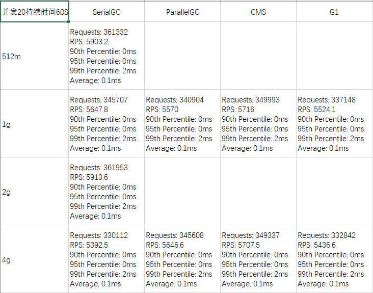
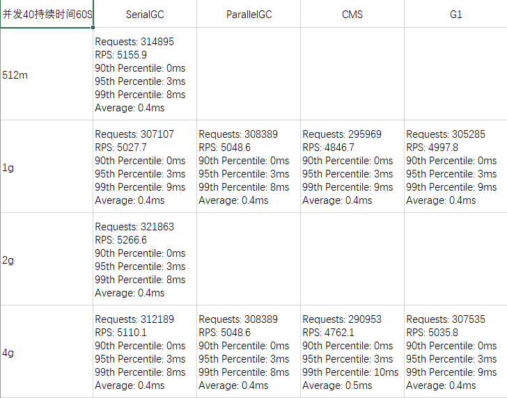

# Tur.周四作业

## W02Tur01

使用 GCLogAnalysis.java 自己演练一遍串行 / 并行 /CMS/G1 的案例。

打印命令：

```java
public static void main(String[] args) {
		String[] gcType = new String[]{"UseSerialGC", "UseParallelGC", "UseConcMarkSweepGC", "UseG1GC"};
		String[] memSize = new String[]{"256m", "512m", "768m", "1g","1536m", "2g", "3g", "4g"};
		String commandTemplate = "java -XX:+%s -Xms%s -Xmx%s -XX:+PrintGCDateStamps -XX:+PrintGCDetails -Xloggc:./%s_%s_gclogs GCLogAnalysis";
		for (String gc: gcType) {
			for (String mem : memSize) {
				System.out.printf(commandTemplate, gc, mem, mem, gc, mem);
				System.out.println("");
			}
		}
}
```

执行结果：




## W02Tur02

​	使用了Superbenchmarker，演练 gateway-server-0.0.1-SNAPSHOT.jar 示例。



​		并发数20，持续时间60秒的测试结果：



​		并发数40持续时间60S测试结果：



## W02Tur03

...


## W02Tur04

​		周四01、02作业总结：

​		当回收较为频繁时，串行回收器在最大堆内存较小时，创建回收对象效率较高；当最大堆内存较大时，串行回收器回收慢，影响整体使用效率。

​		并行回收器在最大堆内存较小时，并行效率并不比串行明显高；但随着最大堆内存设置变大，并行回收效率显著提升，并较为稳定。

​		CMS回收器随着最大堆内存变大，基本创建效率也趋于稳定，但稳定值明显与并行回收器有差距，可见为了减少用户线程停顿，而牺牲了一定回收效率。

​		G1回收器的效率随着最大堆内存的提升一直在提升，可见在内存较大时，G1回收器是首要考虑配置。

​		在作业02的并发测试中，可能因为测试方法较为简单，没有创建对象的操作，各回收器的性能差距并不明显。仅可以观察到，并发数提升后，增加最大堆内存并不能提升对并发任务的处理速度。

# Sat.周六作业

## W02Sat01

...


## W02Sat02

​		见Homework_Sat02。

```java
public class HttpClientDemo {
	public static void main(String[] args) {
		try (CloseableHttpClient httpclient = HttpClients.createDefault()) {
			HttpGet httpGet = new HttpGet("http://localhost:8801");

			try (CloseableHttpResponse response = httpclient.execute(httpGet)) {
				System.out.println(response.getCode() + " " + response.getReasonPhrase());
				HttpEntity entity1 = response.getEntity();
				EntityUtils.consume(entity1);
			}
		} catch (IOException e) {
			e.printStackTrace();
		}
	}
}
```

